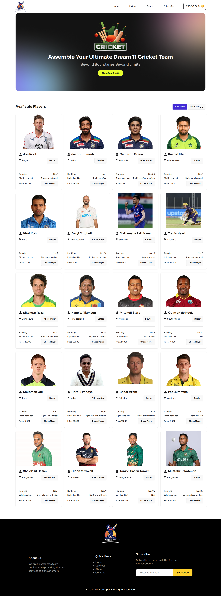

# BPL Dream11

A fantasy cricket team builder application inspired by Dream11, allowing users to create their dream Bangladesh Premier League (BPL) cricket team by selecting players within a coin budget.

## Project Screenshot



## Technologies Used

- React
- Vite
- Tailwind CSS
- DaisyUI
- React Icons
- React Toastify

## Features

- Browse available cricket players with detailed information
- Select players to build your fantasy team
- Coin-based budget system for player selection
- View selected players in a dedicated section
- Responsive design for mobile and desktop
- Toast notifications for user feedback

## Dependencies

### Production Dependencies
- `@tailwindcss/vite`: ^4.2.2
- `react`: ^19.2.4
- `react-dom`: ^19.2.4
- `react-icons`: ^5.6.0
- `react-toastify`: ^11.0.5
- `tailwindcss`: ^4.2.2

### Development Dependencies
- `@eslint/js`: ^9.39.4
- `@types/react`: ^19.2.14
- `@types/react-dom`: ^19.2.3
- `@vitejs/plugin-react`: ^6.0.1
- `daisyui`: ^5.5.19
- `eslint`: ^9.39.4
- `eslint-plugin-react-hooks`: ^7.0.1
- `eslint-plugin-react-refresh`: ^0.5.2
- `globals`: ^17.4.0
- `vite`: ^8.0.1

## Run Locally

Follow these steps to run the project on your local machine:

1. Clone the repository:
   ```bash
   git clone <repository-url>
   ```

2. Navigate to the project directory:
   ```bash
   cd bpl-dream11-code
   ```

3. Install dependencies:
   ```bash
   npm install
   ```

4. Start the development server:
   ```bash
   npm run dev
   ```

5. Open your browser and visit `http://localhost:5173` to view the application.

## Links

- Live Demo: https://dream11-bpl-2027.netlify.app/
- GitHub Repository: https://github.com/ShafayatSadid/bpl-dream11-code
